# OS Orange -4 Lab Report: PES-VCS

Name: Balaraj R  
SRN: PES1UG24CS560  
Assignment: OS Orange -4  
Platform: Ubuntu 22.04

## 1. Objective

This assignment implements a local version control system (PES-VCS) with:

- content-addressable object storage,
- tree snapshot construction,
- staging index management,
- commit creation and history traversal,
- verification through unit and integration tests.

## 2. Implementation Summary

Implemented all required TODO functions:

- object.c
  - object_write
  - object_read
- tree.c
  - tree_from_index
- index.c
  - index_load
  - index_save
  - index_add
- commit.c
  - commit_create

## 3. Screenshot Evidence

### 1A. Phase 1 Unit Test (./test_objects)

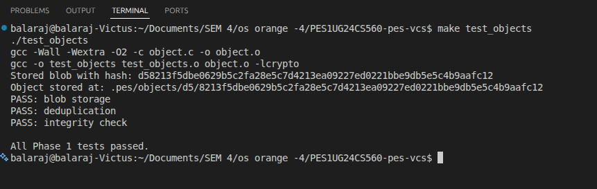

### 1B. Sharded Object Storage (find .pes/objects -type f)

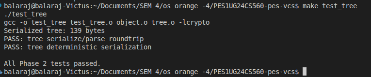

### 2A. Phase 2 Unit Test (./test_tree)

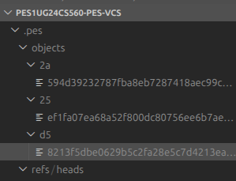

### 2B. Raw Tree Object Binary Format (xxd ... | head -20)

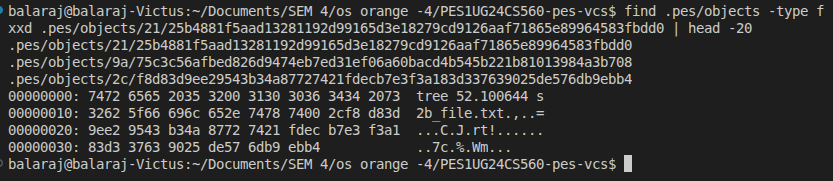

### 3A. pes init + pes add + pes status

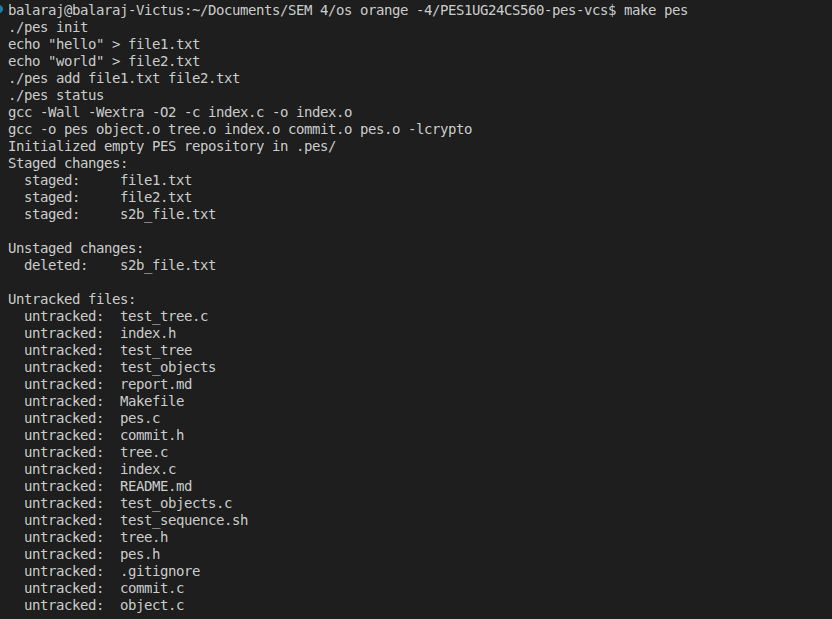

### 3B. Index Text Format (cat .pes/index)

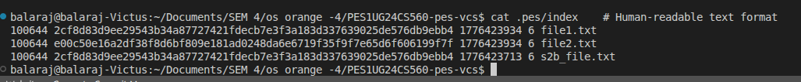

### 4A. Commit History (./pes log with three commits)

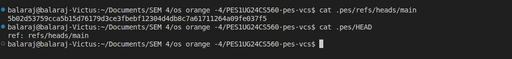

### 4B. Object Store Growth (find .pes -type f | sort)

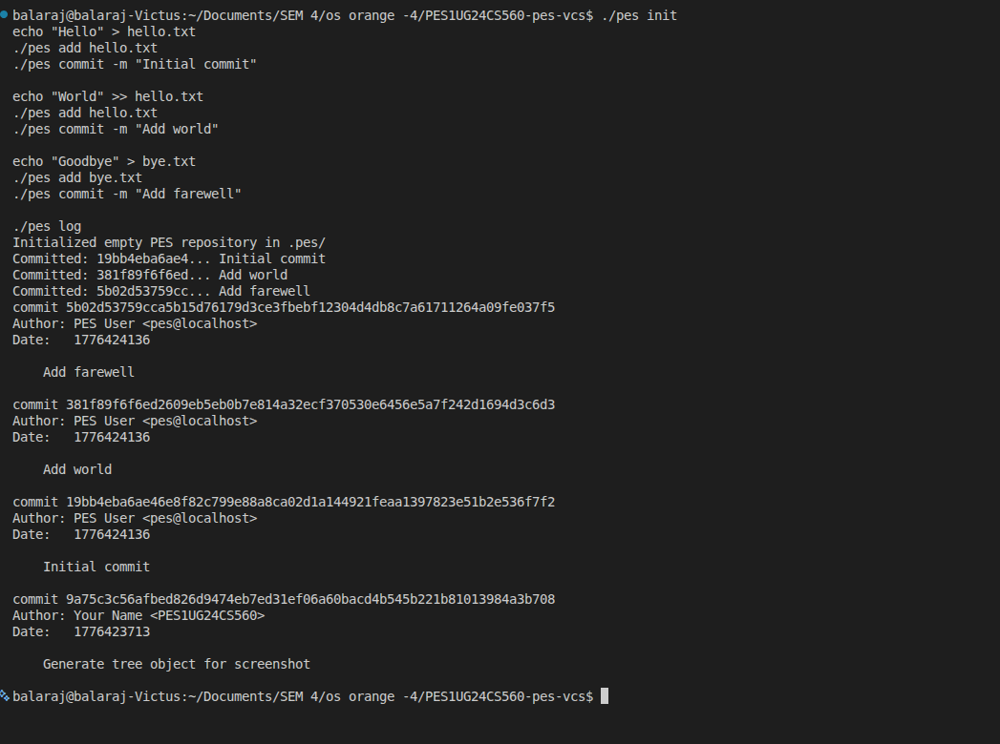

### 4C. Reference Chain (cat .pes/refs/heads/main and cat .pes/HEAD)

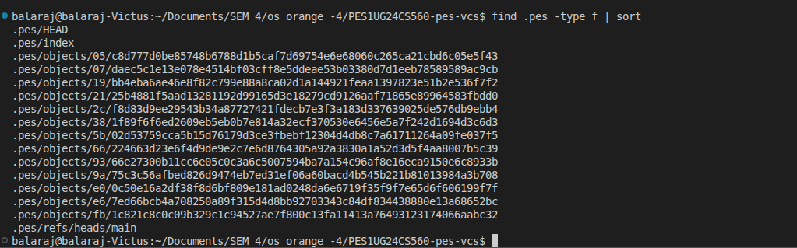

### Final Integration Test (make test-integration)

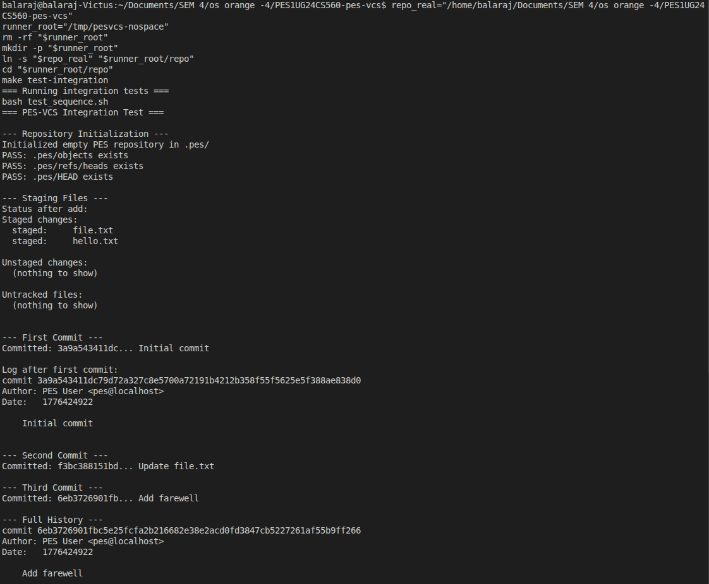

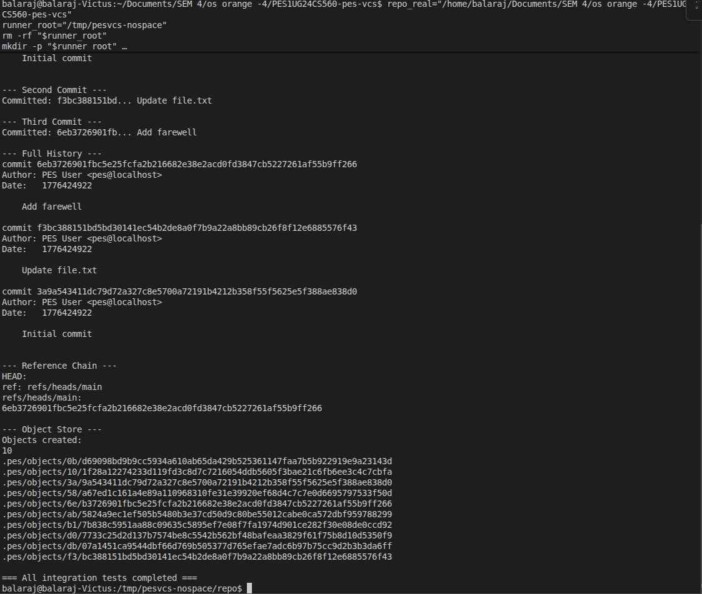

## 4. Analysis Answers

### Q5.1: How would pes checkout <branch> work?

A branch is a ref file in .pes/refs/heads storing a commit hash.

To implement checkout:

1. Resolve the target commit hash from .pes/refs/heads/<branch>.
2. Update .pes/HEAD to point to ref: refs/heads/<branch> (or hash for detached checkout).
3. Read target commit -> target tree.
4. Rewrite working directory to match target tree:
   - create/update files from blobs,
   - create/remove directories,
   - apply modes (100644 or 100755),
   - remove tracked paths not present in target tree.
5. Rewrite .pes/index so staged state matches checked-out snapshot.

Why complex:

- Must safely coordinate HEAD, index, and working directory updates.
- Must avoid overwriting local uncommitted work.
- Must handle deletes, nested trees, and mode changes atomically.

### Q5.2: Detect dirty working directory conflicts using index + object store

Use three snapshots:

- A: index entries (path -> staged blob hash + metadata)
- B: current HEAD tree (from object store)
- C: target branch tree (from object store)

Conflict detection:

1. For each tracked path in union(A, B), inspect working directory file.
2. If missing or metadata differs from index entry, confirm by hashing file and comparing with A[path].hash.
3. Mark path dirty if working file != staged/index version.
4. If dirty path would change between current and target (B[path] != C[path], or present/deleted mismatch), refuse checkout.

This prevents local changes from being overwritten by branch switching.

### Q5.3: Detached HEAD behavior and recovery

Detached HEAD means .pes/HEAD stores a commit hash directly, not a branch ref.

If commits are made in detached state:

- commits are created normally,
- parent chain is valid,
- but no branch pointer advances.

These commits can become unreachable once HEAD moves away.

Recovery:

- create a branch ref pointing to that detached commit hash
  (write hash into .pes/refs/heads/<new-branch>) before GC.

### Q6.1: Algorithm for garbage collection of unreachable objects

Use mark-and-sweep.

Mark phase:

1. Start from all refs in .pes/refs/heads/* (and detached HEAD hash, if any).
2. Traverse commits recursively:
   - mark commit hash,
   - traverse parent,
   - traverse commit tree.
3. Traverse tree objects recursively:
   - mark tree hash,
   - mark blob hashes,
   - recurse into subtree hashes.

Sweep phase:

1. Scan all .pes/objects/*/* files.
2. Convert path to object hash.
3. Delete objects not in reachable set.

Data structure:

- hash set for reachable hashes (O(1) expected lookup).
- stack/queue for DFS/BFS traversal.

Scale estimate for 100,000 commits and 50 branches:

- typically near unique reachable history, not 100,000 x 50,
- about 100,000 commit objects plus corresponding reachable trees/blobs,
- usually hundreds of thousands to a few million total reachable objects depending on file churn.

### Q6.2: Why concurrent GC with commit is dangerous

Race example:

1. Commit process writes new blobs/trees first.
2. Before commit ref update, these objects are temporarily unreachable from refs.
3. Concurrent GC marks from current refs and misses those new objects.
4. GC sweep deletes them.
5. Commit object is then written/updated to reference deleted objects.

Result: broken commit graph with missing objects.

How Git avoids this:

- uses locking and coordinated updates around refs,
- uses conservative pruning windows (do not immediately prune recent loose objects),
- manages pack/visibility safely to avoid deleting in-flight objects.

## 5. Notes

- Integration test script path issue with spaces was handled by running from a no-space symlink path:
  - /tmp/pesvcs-nospace/repo
- This preserves provided files unchanged while allowing successful execution.
